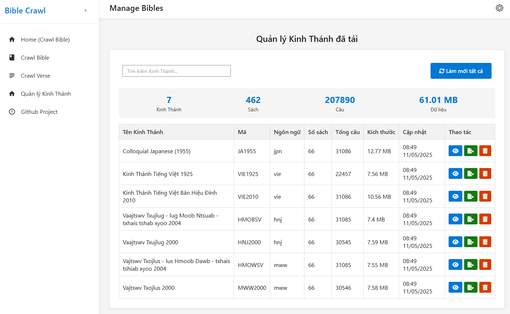

# Bible Crawl



Bible Crawl là một dự án PHP để thu thập, quản lý và xuất dữ liệu Kinh Thánh từ các nguồn trực tuyến như
```sh
https://www.bible.com/
```

## Tính năng chính

- **Thu thập dữ liệu Kinh Thánh**: Lấy dữ liệu từ Bible.com với nhiều phiên bản và ngôn ngữ khác nhau.
- **Quản lý Kinh Thánh**: Giao diện quản lý toàn diện cho tất cả các bản Kinh Thánh đã tải xuống.
- **Thống kê và phân tích**: Hiển thị số liệu tổng hợp về số sách, câu, và kích thước dữ liệu.
- **Tìm kiếm nâng cao**: Tìm kiếm theo Kinh Thánh, sách, hoặc nội dung câu.
- **Xuất dữ liệu**: Xuất dữ liệu Kinh Thánh dưới dạng ZIP với cấu trúc thư mục đồng nhất.
- **Hiệu suất cao**: Hỗ trợ xử lý đồng thời nhiều yêu cầu để tăng tốc độ thu thập dữ liệu.
- **Tạm dừng/Tiếp tục/Hủy**: Kiểm soát quá trình thu thập dữ liệu linh hoạt.

## Yêu cầu hệ thống

- PHP >= 8.1
- Composer
- Web server (Apache, Nginx, hoặc PHP built-in server)
- JavaScript được bật trên trình duyệt

## Cài đặt

1. Clone repository:

    ```sh
    git clone https://github.com/pyhteam/Bible-Craw.git
    cd Bible-Craw
    ```

2. Cài đặt các phụ thuộc bằng Composer:

    ```sh
    composer install
    ```

3. Đảm bảo thư mục `data` và các thư mục con của nó có quyền ghi:

    ```sh
    chmod -R 755 data
    ```

## Cấu trúc thư mục

- `api/`: Chứa các API để xây dựng và lấy dữ liệu Kinh Thánh.
  - `build-bible.php`: Tạo dữ liệu cơ bản cho một phiên bản Kinh Thánh.
  - `build-book.php`: Tạo dữ liệu cho các sách.
  - `build-chapter.php`: Tạo dữ liệu cho các chương.
  - `build-verse.php`: Tạo dữ liệu cho các câu Kinh Thánh.
  - `export-bible.php`: API xuất dữ liệu Kinh Thánh thành file ZIP.
  - `manage-bibles.php`: API quản lý dữ liệu Kinh Thánh.

- `data/`: Chứa dữ liệu Kinh Thánh đã thu thập.
  - `bibles/`: Thông tin về các phiên bản Kinh Thánh.
  - `books/`: Thông tin về các sách.
  - `chapters/`: Thông tin về các chương.
  - `verses/`: Nội dung các câu Kinh Thánh.
  - `temp/`: Thư mục tạm thời cho việc xuất dữ liệu.

- `pages/`: Giao diện người dùng.
  - `crawl-bible.php`: Trang thu thập dữ liệu phiên bản Kinh Thánh.
  - `crawl-book.php`: Trang thu thập dữ liệu sách.
  - `crawl-verse.php`: Trang thu thập dữ liệu câu Kinh Thánh.
  - `manage-bibles.php`: Trang quản lý tất cả Kinh Thánh đã tải.

- `assets/`: Tài nguyên UI (CSS, JavaScript, hình ảnh).

## Sử dụng

### Chạy dự án

Để chạy dự án, bạn có thể sử dụng PHP built-in server:

```sh
php -S localhost:8000
```

### Thu thập dữ liệu Kinh Thánh

1. Truy cập trang "Lấy Kinh Thánh" để thu thập thông tin cơ bản về một phiên bản Kinh Thánh.
2. Sử dụng trang "Lấy Sách" để thu thập dữ liệu về các sách trong phiên bản đã chọn.
3. Sử dụng trang "Lấy Câu Kinh Thánh" để thu thập nội dung từng câu.

### Quản lý Kinh Thánh

1. Truy cập trang "Quản lý Kinh Thánh đã tải" để xem tất cả các phiên bản đã thu thập.
2. Từ đây bạn có thể:
   - Xem chi tiết từng phiên bản Kinh Thánh
   - Tải sách còn thiếu
   - Làm mới số liệu thống kê
   - Xuất dữ liệu dưới dạng ZIP
   - Xóa dữ liệu không cần thiết

## Đóng góp

Nếu bạn muốn đóng góp cho dự án, vui lòng tạo pull request hoặc báo cáo các vấn đề qua GitHub issues.

## Giấy phép

[MIT License](LICENSE)  
```sh
    https://www.bible.com/
```

## Yêu cầu hệ thống

- PHP >= 8.1
- Composer

## Cài đặt

1. Clone repository:

    ```sh
    git clone https://github.com/pyhteam/Bible-Craw.git
    cd Bible-Craw
    ```

2. Cài đặt các phụ thuộc bằng Composer:

    ```sh
    composer install
    ```

## Cấu trúc thư mục

- `api/`: Chứa các script PHP để xây dựng và lấy dữ liệu Kinh Thánh.
- `data/`: Chứa dữ liệu Kinh Thánh đã thu thập.
- `pages/`: Chứa các trang PHP để hiển thị và thu thập dữ liệu Kinh Thánh.
- `vendor/`: Chứa các thư viện bên thứ ba được cài đặt bởi Composer.

## Sử dụng

### Chạy dự án

Để chạy dự án, bạn có thể sử dụng PHP built-in server:

```sh
php -S localhost:8000
